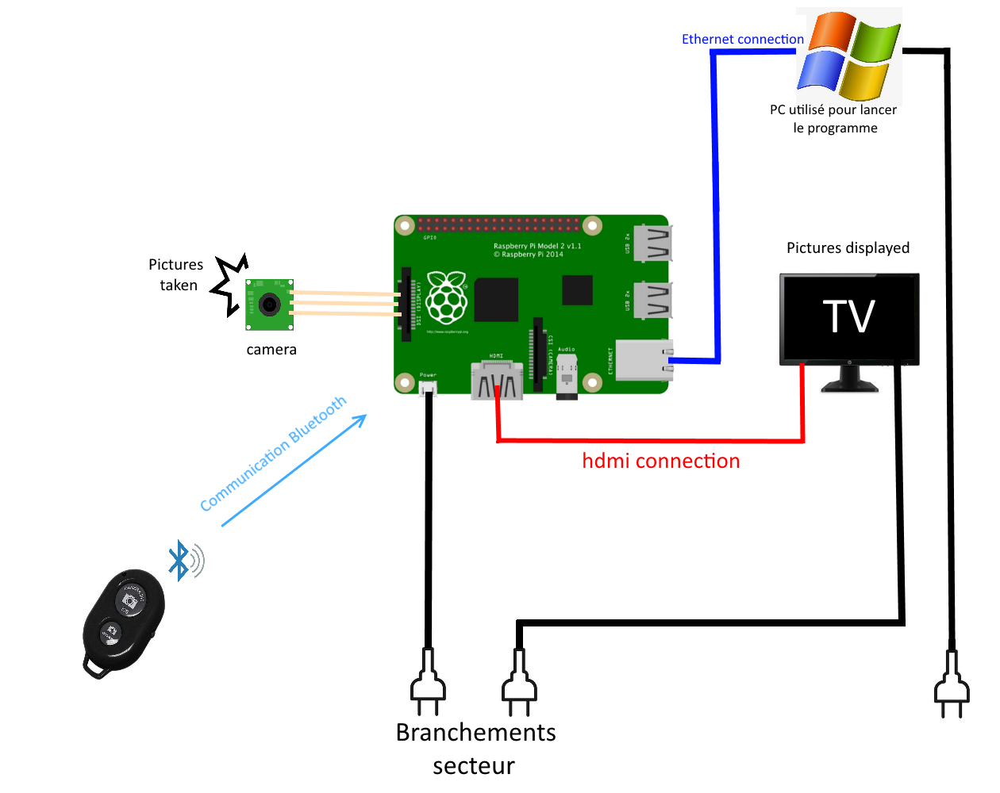

# Photobooth pour le mariage

Okay.

Voici donc la doc sur le Photobooth (PB) qu'on va utiliser pour notre mariage.

Donc, le PB fonctionne sur un Raspberry pi (PI), qui est relié à une caméra, et à un écran.

Ici, je vais essayer de tous lister pour pouvoir s'en sortir sans problèmes.

## Architecture du projet

Comme une image vaut mieux qu'un long discours :

Donc, il y a 

## Procédure à suivre pour l'installation

Okay. Voici la procédure à suivre point par point pour lancer le machin : 

